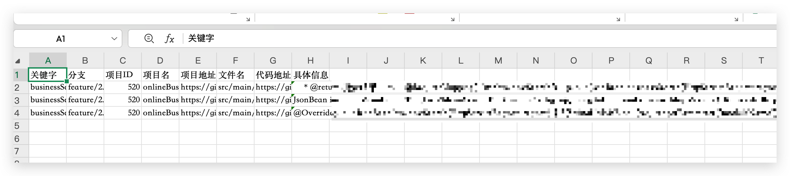

# gitlab-code-search-py

一个基于 Python 的 GitLab 代码检索工具：

- 支持按关键字搜索
- 支持搜索全部项目或单个项目
- 支持单分支或全部分支搜索
- 支持并发检索（默认 `--workers 8`）
- 支持并发进度条（默认显示）
- 自动导出 Excel 结果

## 功能特性

- 多关键字搜索：`-w 'a,b' -w 'c'`
- 单项目搜索：`-u` 直接传项目 URL
- 全分支搜索：`--all-branches`
- 并发检索：`--workers`（默认 8）
- 进度条开关：`--no-progress`（关闭进度条）
- 结果导出：`YYYY_MM_DD_HH_MM.xlsx`

## 环境要求

- Python 3.9+
- 建议使用虚拟环境（如 `.venv`）

## 安装

```bash
.venv/bin/python -m pip install -e .
```

安装后命令入口为：

```bash
.venv/bin/gcs
```

查看版本：

```bash
.venv/bin/gcs --version
./dist/gcs --version
```

开始使用前，请先创建 GitLab Token：

- [如何创建 GitLab Token](docs/gitlab-token.md)

## 使用说明

### 1) 搜索所有项目（默认分支）

```bash
.venv/bin/gcs search \
  -u 'https://gitlab.example.com' \
  -t 'your_token' \
  -w 'businessSearch'
```

默认不带 `-b` 时，按项目主分支检索（例如 main/master）。

### 2) 搜索单个项目

```bash
.venv/bin/gcs search \
  -u 'https://gitlab.example.com/group/subgroup/project' \
  -t 'your_token' \
  -w 'businessSearch'
```

### 3) 指定分支

```bash
.venv/bin/gcs search \
  -u 'https://gitlab.example.com/group/subgroup/project' \
  -t 'your_token' \
  -w 'businessSearch' \
  -b 'main'
```

### 4) 搜索全部分支

```bash
.venv/bin/gcs search \
  -u 'https://gitlab.example.com/group/subgroup/project' \
  -t 'your_token' \
  -w 'businessSearch' \
  --all-branches
```

### 5) 提速（并发 worker）

默认并发（等价于 `--workers 8`）：

```bash
.venv/bin/gcs search \
  -u 'https://gitlab.example.com/group/subgroup/project' \
  -t 'your_token' \
  -w 'businessSearch' \
  --all-branches
```

默认会显示并发任务进度条（包含完成比例、速度、ETA）。

指定并发：

```bash
.venv/bin/gcs search \
  -u 'https://gitlab.example.com/group/subgroup/project' \
  -t 'your_token' \
  -w 'businessSearch' \
  --all-branches \
  --workers 16
```

关闭进度条：

```bash
.venv/bin/gcs search \
  -u 'https://gitlab.example.com/group/subgroup/project' \
  -t 'your_token' \
  -w 'businessSearch' \
  --all-branches \
  --no-progress
```

### 6) 多关键字

```bash
.venv/bin/gcs search -u 'https://gitlab.example.com' -t 'your_token' -w 'a,b,c'
.venv/bin/gcs search -u 'https://gitlab.example.com' -t 'your_token' -w 'a,b' -w 'c'
```

## 输出说明

- 执行完成后会在当前目录生成 Excel 文件
- 表头包含：关键字、分支、项目信息、文件名、代码链接、命中内容



## 打包 macOS 可执行文件

安装打包工具（在 `.venv` 内）：

```bash
.venv/bin/python -m pip install pyinstaller
```

构建：

```bash
./scripts/build_macos.sh
```

产物：

```bash
dist/gcs
```

## GitHub Actions 自动发布

仓库已配置工作流：

- 文件：`.github/workflows/release.yml`
- 触发条件：推送 `v*` 格式的 tag（例如 `v0.1.0`）
- 自动构建平台：
  - macOS Intel（x86_64）
  - macOS Apple Silicon（arm64）
  - Linux x86_64
  - Windows x86_64
- 自动创建 GitHub Release 并上传二进制附件

触发示例：

```bash
git tag v0.1.0
git push origin v0.1.0
```

## 安全建议

- 不要把真实 token 写入代码或提交到 Git 仓库
- 建议通过环境变量传 token，或运行时手动传入
- 若 token 曾暴露，请立即在 GitLab 端执行 rotate/revoke

## 致谢

本项目是对 [`eryajf/gitlabCodeSearch`](https://github.com/eryajf/gitlabCodeSearch) 的 Python 改写版本并添加了全部分支搜索功能。
